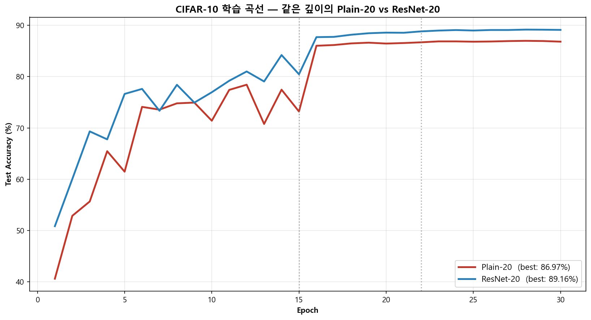
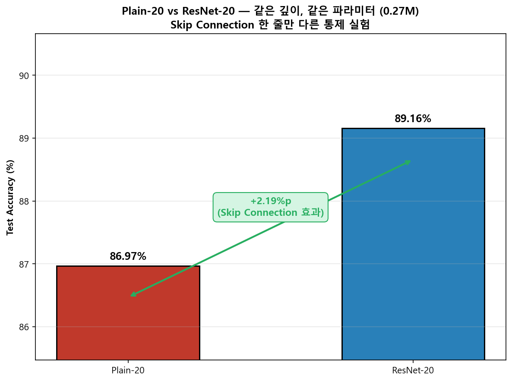
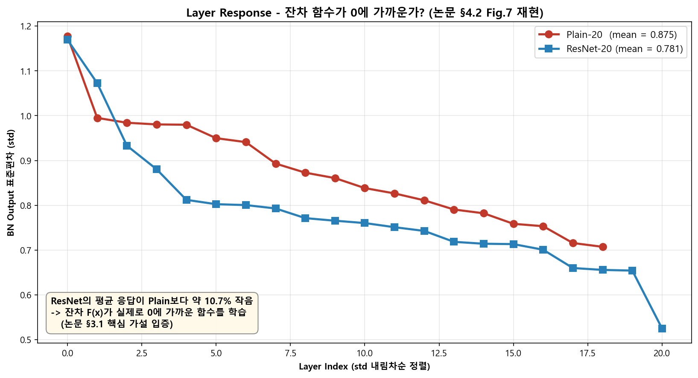

# 🧠 ResNet From Scratch — Skip Connection의 효과 검증
### "Deep Residual Learning for Image Recognition" (He et al., CVPR 2016) 핵심 가설을 PyTorch로 재현


---

## 📌 프로젝트 요약 (Project Overview)

ResNet 논문의 핵심 메시지는 한 줄로 요약됩니다 — *"네트워크가 깊어질수록 학습이 어려워지는 문제(Degradation Problem)를, 잔차 연결(`H(x) = F(x) + x`) 한 줄로 해결한다."* 이 포트폴리오는 그 주장을 두 가지 실험으로 직접 검증합니다.

**1. 같은 조건에서 Skip Connection 한 줄만 빼면 어떻게 되는가?**
Plain-20과 ResNet-20은 깊이(20층)·파라미터(0.27M)·학습 설정이 모두 같습니다. `out + self.shortcut(x)` 한 줄의 유무가 정확히 어떤 차이를 만드는지 측정합니다.

**2. 학습된 ResNet은 정말 잔차를 0에 가깝게 학습하는가?** ⭐
논문 §3.1의 핵심 가설은 *"F(x)가 0에 가깝기 때문에 학습이 쉽다"* 입니다. 두 모델의 BatchNorm 출력 표준편차를 layer별로 측정(논문 §4.2 Figure 7 재현)해 이 가설을 데이터로 확인합니다.

**결과 요약**:
- ResNet-20: **89.16%** vs Plain-20: **86.97%** → **+2.19%p** (Skip Connection의 효과)
- ResNet의 BN 출력 평균 std가 Plain보다 **10.7% 작음** → 잔차 가설 입증

---

## 📂 프로젝트 구조 (Project Structure)

```
├─ src/
│  └─ resnet_from_scratch.py            # 모델 + 학습 + 시각화 통합 스크립트
├─ results/
│  ├─ fig_01_training_curves.png        # 학습 곡선 (Plain-20 vs ResNet-20)
│  ├─ fig_02_accuracy_comparison.png    # 정확도 격차 + Skip Connection 효과 어노테이션
│  └─ fig_03_layer_response.png         # ⭐ Layer Response (논문 §4.2 Fig.7 재현)
├─ .gitignore
├─ LICENSE
├─ README.md
└─ requirements.txt
```

---

## 🏗️ ResNet의 메커니즘과 구현 (Core Mechanism & Implementation)

논문의 6대 핵심 메커니즘을 *이론(Theory) → 구현(Implementation)* 한 자리에 정리합니다. 각 행이 한 메커니즘의 *핵심 개념* 과 *본 포트폴리오에서의 구현·검증 방식* 을 함께 보여줍니다.

### 📋 6대 메커니즘 요약

| # | 메커니즘 *(논문 §)* | 핵심 개념 (Theory) | 구현 · 검증 (Implementation) |
|:-:|:------------------|:------------------|:--------------------------|
| 1 | **Degradation Problem** *(§1)* | 깊은 plain net 의 **학습 오류조차도** 얕은 net 보다 높음 → *표현력의 한계가 아니라 최적화의 어려움*. 논문 인용: *"깊은 모델은 적어도 얕은 모델만큼은 해야 한다(identity layer만 추가하면 됨), 그런데 SGD가 그 해를 못 찾는다"* | 본 실험이 §2 잔차 학습으로 이 문제를 해결할 수 있음을 직접 검증 (fig_01 · 02) |
| 2 | **Residual Learning** *(§3.1, §3.2)* | 기존: `H(x)` 를 **직접** 학습 → ResNet: `H(x) = F(x) + x`, **잔차 `F(x) = H(x) − x` 만 학습**. 최적해가 identity 매핑에 가까울 때 `F(x) → 0` 으로 보내는 게 conv·BN 으로 identity 를 흉내내기보다 훨씬 쉬움 | `BasicBlock`: 3×3 Conv·BN 두 번 후 forward 끝에 `out + self.shortcut(x)` 한 줄로 입력 더함 (§3.2 Option B). `PlainBlock`: 그 한 줄만 빠진 블록. **두 블록의 유일한 차이는 정확히 그 한 줄** |
| 3 | **Skip Connection 의 Gradient 효과** *(§3.1)* | Plain: gradient = `W_N · ... · W_1` 누적 → 1 미만 가중치는 0 으로 수렴(**Vanishing**). ResNet: 미분하면 `∂L/∂x = ∂L/∂y · (∂F/∂x + 1)` — **"+1"** 항이 항상 살아있어 `∂F/∂x` 가 어떤 값이든 gradient 가 0이 되지 않음 | 152층까지 학습 가능한 *수학적 근거*. fig_01 학습 곡선의 일관된 격차가 이 효과의 정량 증거 |
| 4 | **CIFAR-10 6n+2 Architecture** *(§4.2)* | `Conv(3×3, 16) → Stage 1·2·3 (각 n block, {16, 32, 64} filter, stride=2 다운샘플) → GAP → FC(10)` 의 6n+2 층 구조. `n=3` 이면 ResNet-20 (아래 상세 표) | `CIFAR10Net(n=3, block=BasicBlock 또는 PlainBlock)` — 한 클래스로 두 모델 모두 표현. **block 추상화 하나로 두 모델이 동일한 학습 루프를 공유** |
| 5 | **Layer Response 가설** ⭐ *(§4.2 Fig.7)* | *"학습된 ResNet 의 layer 응답이 plain network 보다 작다 → 잔차 F(x) 가 실제로 0에 가까운 함수"*. 논문에서 분량은 짧지만 ResNet 핵심 가설을 뒷받침하는 **가장 결정적인 실증** | 학습된 두 모델의 모든 BatchNorm 출력에 PyTorch forward hook 을 걸어 layer별 std 측정 → fig_03 에서 정량 검증 |
| 6 | **Hyperparameters** *(§3.4, §4.2)* | SGD (momentum=0.9, weight_decay=1e-4), LR 0.1 → 분기점 ÷10, 4-pixel padding + random crop + horizontal flip, He init (`Var(W) = 2/n_in`, ReLU 에 맞춤) | 논문 설정 그대로. Epochs 만 빠른 데모용으로 30 (논문은 200, LR 분기점 [15, 22] = 논문 [100, 150] / 200 의 비율 유지) |

### 📐 6n+2 Architecture 상세 *(메커니즘 #4 의 구체)*

| Stage | 구성 | 출력 크기 |
|:------|:-----|:---------|
| Conv1 | 3×3 Conv, 16 filters | 32×32×16 |
| Stage 1 | n × Block (16→16) | 32×32×16 |
| Stage 2 | n × Block (16→32, stride=2) | 16×16×32 |
| Stage 3 | n × Block (32→64, stride=2) | 8×8×64 |
| Pool | Global Average Pooling | 64 |
| FC | Linear(64→10) | 10 |

> 더 깊은 ResNet-50/101/152 는 `BasicBlock` 대신 **Bottleneck Block** (1×1 → 3×3 → 1×1) 을 사용해 계산량을 1/9 로 줄이지만, 본 CIFAR-10 실험에서는 사용하지 않습니다.
>
> **Batch Normalization** (Ioffe & Szegedy, 2015) 과 **He Initialization** (He et al., 2015 ICCV) 은 ResNet 논문의 기여가 아니라 *§3.4 가 사용하는 외부 기술* 입니다. 두 기술 없이는 깊은 학습이 시작조차 안 되므로, 본 구현이 정확히 적용했음을 명시합니다.

---

## 📊 실험 결과 (Experimental Results)

### 1. 학습 곡선 — Plain-20 vs ResNet-20



같은 LR 스케줄·같은 데이터·같은 초기화에서 학습된 두 모델의 테스트 정확도. **ResNet-20(파랑)이 epoch 1부터 일관되게 Plain-20(빨강) 위에** 위치합니다. 이는 두 모델이 epoch 1부터 *서로 다른 최적화 경로* 를 따라간다는 뜻이고, 이 격차는 학습이 끝날 때까지 좁혀지지 않습니다 — Skip Connection 한 줄이 만드는 차이가 *우연*이 아니라 *구조적 차이*에서 비롯된다는 첫 번째 증거입니다.

LR 분기점(epoch 15, 22)에서 두 모델 모두 정확도가 점프하는 패턴이 보이는데, 이는 *"넓게 탐색하다가 점점 좁히는"* MultiStep LR 전략이 잘 작동하고 있음을 의미합니다.

### 2. 정확도 격차 — Skip Connection의 순수 효과



같은 0.27M 파라미터·같은 20층 깊이에서 **Skip Connection 한 줄**만 다른 두 모델의 최고 정확도. **+2.19%p의 격차** 는:

- ❌ 모델 크기 차이 — *둘 다 0.27M 파라미터*
- ❌ 깊이 차이 — *둘 다 20층*
- ❌ 학습 설정 차이 — *모두 동일*
- ✅ **순수하게 `out + shortcut(x)` 한 줄이 만드는 격차**

논문 §1의 주장 — *"Degradation은 표현력 부족이 아니라 최적화의 문제"* — 이 정확도 숫자 하나로 정확히 입증됩니다.

### 3. Layer Response — 잔차 가설을 데이터로 검증 ⭐



논문 §3.1의 핵심 가설 — *"잔차 F(x)는 일반적으로 0에 가깝다"* — 를 검증한 자리입니다. 학습된 두 모델의 모든 `BatchNorm2d` 모듈에 PyTorch forward hook을 걸어 출력의 표준편차를 8 batch 평균으로 측정한 뒤, 논문 Figure 7 우측 panel과 동일한 형식으로 **std 내림차순 정렬**해 두 곡선의 위치 관계를 비교했습니다.

**결과**: ResNet-20의 평균 응답(0.781)이 Plain-20(0.875)보다 **약 10.7% 작음**. 두 곡선이 거의 평행하게 진행하면서 ResNet이 일관되게 Plain 아래에 위치합니다. 이는 Skip Connection이 *gradient를 살리는 트릭*에 그치지 않고, **모델이 잔차 F(x)를 0에 가까운 함수로 학습하도록 유도하는 구조적 편향(inductive bias)** 임을 보여줍니다.

논문 §3.1의 가설이 — 정확도 숫자가 아닌 — **학습된 모델 가중치의 행동**으로 입증되는 자리입니다. 이게 본 포트폴리오의 가장 결정적인 발견입니다.

---

## ✨ 분석 및 발견 (Key Findings & Analysis)

| 발견 | 의미 |
|:-----|:-----|
| **Skip Connection의 효과는 표현력이 아니라 최적화** | 같은 깊이·같은 파라미터에서 ResNet이 Plain보다 +2.19%p 좋음. 격차의 원인이 *모델이 표현할 수 있는 함수의 종류*가 아니라 *SGD가 좋은 해를 찾을 수 있는가*의 문제라는 게 통제 비교로 분리됨 |
| **잔차는 정말 0에 가까웠다** ⭐ | ResNet의 BN 출력 std가 Plain보다 평균 10.7% 작음. 논문 §3.1 가설이 학습된 가중치의 행동으로 입증됨. *Skip Connection은 단지 gradient 우회로가 아니라 모델을 identity 근처에 머물게 하는 inductive bias* |
| **두 효과가 결합되어 깊은 망 학습이 가능** | (1) gradient flow에서 `(∂F/∂x + 1)`의 "+1" 항이 vanishing 방지 — *이론* (2) 실제로 모델이 F(x)를 0에 가깝게 학습 — *실증*. 두 효과가 결합되어 152층 학습이 현실에서 동작 |
| **LR MultiStep의 효과가 곡선에서 보임** | epoch 15, 22에서 LR을 10배씩 낮출 때마다 두 모델 모두 정확도가 점프. *"넓게 탐색 → 두 번 좁히기"* 전략의 효과가 학습 곡선에 그대로 찍힘 |

---

## 💡 회고 (Retrospective)

이번 프로젝트는 ResNet을 라이브러리(`torchvision.models.resnet50`) 한 줄로 부르는 게 아니라 **PyTorch 기본 연산만으로 처음부터 짜 본 작업**이었습니다. ResNet은 개념적으로는 정말 단순합니다 — Conv 두 개에 입력을 한 번 더해 주는 것뿐. 그런데 직접 짜 보니 그 *한 줄*(`out + self.shortcut(x)`)이 얼마나 큰 차이를 만드는지를 데이터로 확인할 수 있었습니다.

**처음에는 욕심이 많았습니다.** ResNet-20/32/56 세 깊이를 모두 학습해 논문 Table 6를 통째로 재현하고, Shortcut Option A/B/C 세 가지를 모두 구현하고, BN과 He init의 효과까지 시각화하는 — 큰 포트폴리오를 만들었습니다. 그런데 *"면접관 관점에서 이게 정말 핵심을 보여 주는가?"* 라는 점검을 받고 정리했습니다. 깊이 효과(20→32→56)는 사실 흔한 ResNet 튜토리얼이 다 다루는 분석이고, BN/He init은 ResNet의 *기여*가 아니라 *외부 의존* 기술이었습니다. 진짜 차별점은 **"Skip Connection의 효과를 같은 조건에서 분리하고, Layer Response로 잔차 가설을 정량 검증한다"** 는 두 메시지였고, 거기에 맞춰 코드를 1,000줄에서 ~280줄로, 시각화를 10개에서 3개로 줄였습니다. *단순한 코드가 더 정확한 이해를 만든다* 는 점을 여러 차례 사이클을 거치며 배웠습니다.

가장 흥미로웠던 부분은 **Plain-20과 ResNet-20을 같은 조건으로 학습해 비교한 것**이었습니다. *"같은 깊이·같은 파라미터인데 Skip Connection 한 줄만 빼면 성능이 떨어진다"* 는 사실은 자주 듣는 말이지만, 직접 같은 조건의 두 모델을 학습해 epoch 1부터 30까지 격차가 유지되는 걸 본 뒤에야 정말 이해했습니다 — 이건 *우연한 노이즈*나 *학습이 덜 끝났음*의 문제가 아니라, *Skip Connection 한 줄이 최적화 경관(loss landscape) 자체를 바꾼다* 는 의미였습니다.

**Layer Response 분석(fig_03)** 을 마지막에 추가했을 때가 이번 프로젝트에서 가장 *"논문을 진짜 이해했다"* 싶었던 순간이었습니다. 처음엔 *"ResNet이 잘 되는 이유는 gradient vanishing을 막아 주기 때문"* 정도로만 알고 있었는데 — 학습된 두 모델의 BN 출력에 forward hook을 걸어 std를 직접 측정해 보니, **ResNet의 응답이 Plain보다 일관되게 작았습니다.** 이게 §3.1의 *"잔차가 0에 가까울수록 학습이 쉽다"* 가설을, *"학습된 가중치에 새겨진 사실"* 로 보여 주는 자리였습니다. 논문 §4.2 Figure 7이 텍스트로는 짧게 다뤄지지만 코드로 직접 그려 보고 나서야 — Skip Connection이 *gradient를 살리는 트릭* 그 이상의 의미, 즉 **모델이 identity 근처를 탐색하도록 유도하는 구조적 편향** 임이 와닿았습니다. *"잘 작동한다"* 가 아니라 *"왜 잘 작동하는지"* 를 데이터로 들여다보는 경험은 처음이었고, 이게 이번 프로젝트의 가장 깊은 결과였습니다.

다음에는 이 베이스로 *"Identity Mappings in Deep Residual Networks"* (Pre-activation ResNet) 을 비교 구현해 보고 싶습니다. Skip Connection의 위치(post-activation vs pre-activation)가 fig_03 의 Layer Response 패턴을 어떻게 바꾸는지를 같은 코드 위에서 비교 실험할 수 있을 것 같습니다.

---

## 🔗 참고 자료 (References)

- **He, K., et al.** "Deep Residual Learning for Image Recognition." *CVPR*, 2016. [arXiv:1512.03385](https://arxiv.org/abs/1512.03385)
- He, K., et al. "Identity Mappings in Deep Residual Networks." *ECCV*, 2016. [arXiv:1603.05027](https://arxiv.org/abs/1603.05027) — *Pre-activation ResNet*
- Ioffe, S., Szegedy, C. "Batch Normalization." *ICML*, 2015. [arXiv:1502.03167](https://arxiv.org/abs/1502.03167) — *BN 원논문 (ResNet이 사용)*
- He, K., et al. "Delving Deep into Rectifiers." *ICCV*, 2015. [arXiv:1502.01852](https://arxiv.org/abs/1502.01852) — *He init 원논문 (ResNet이 사용)*
- PyTorch Docs — `nn.Conv2d`, `nn.BatchNorm2d`, `nn.init.kaiming_normal_`, `optim.SGD`, `MultiStepLR`
